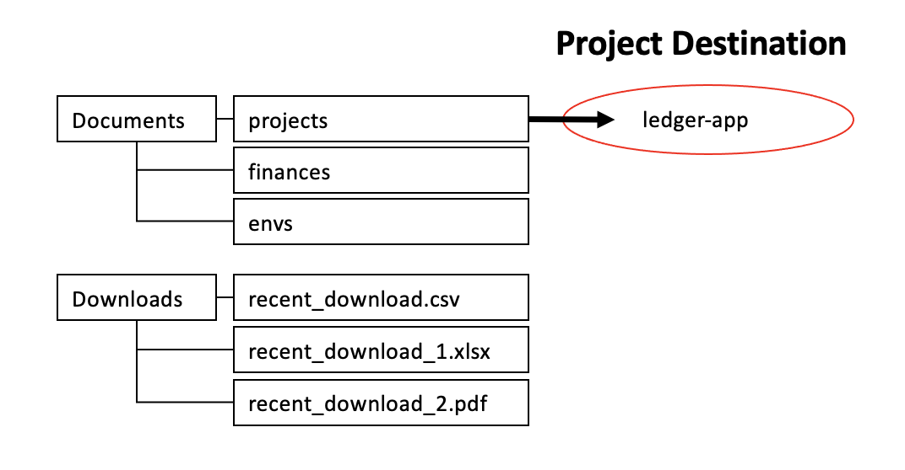

# Ledger Case Study

Hello! My name is Will Sparrow and this README will give you more details on the "app" I have built, including additional context regarding the associated code, how to run the app, where to locate certain files, etc. Please reach out to me if you have any questions. Thank you.

## Running the application

### Prerequisites
#### Node
* Ensure that you have the most up to date version of Node installed. You can check if you have it installed by opening up a terminal window/command prompt and executing `node --version` or `node -v`. If you do not have it installed, download the most stable version from [Node's](https://nodejs.org/en/) website.

#### Clone Repo
* In the top right corner above this README, click the 'Code' dropdown highlighted in green and copy the web URL (beginning with HTTPS). Open up a terminal/command prompt on your computer or within your favorite editor/IDE (e.g., Visual Studio Code) and navigate to the folder where you would like to place this project. For example, if you would like to place the app within a projects folder, navigate using the cd commands like below and execute the commands to clone the repo.

